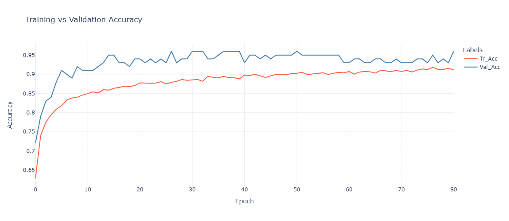
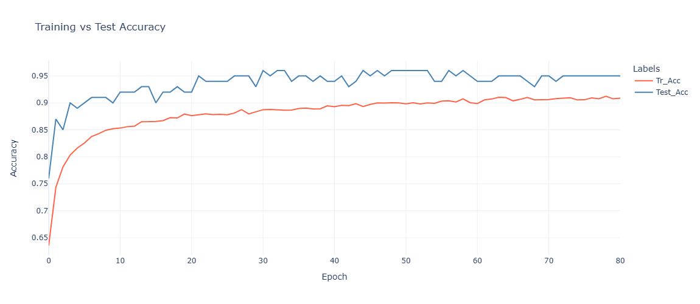

## AI-ANN Classification - Telecom Customer Churn Prediction


## A. Data Assessment Process   
### A1. Original Dataset Summary:
- Total number of records: 4250
- Total number of features: 20
- Numeric type features: 15 **['total_day_minutes', 'total_day_charge', 'total_eve_minutes', 'total_eve_charge', 'total_night_minutes', 'total_night_charge', 'total_intl_minutes', 'total_intl_charge', 'account_length', 'number_vmail_messages', 'total_day_calls', 'total_eve_calls', 'total_night_calls', 'total_intl_calls', 'number_customer_service_calls']**
- Categorical type features: 5 **['state', 'area_code', 'international_plan', 'voice_mail_plan', 'churn']**
- For ML and AI applications **'churn'** feature is the target variable (dependent) and the other 19 features are input (independent).

### A2. Features Description:
| S.NO | Feature                        | Description                                                              |
|:----:| :---                           | :---                                                                     |
| 1.   | state                          | 2-letter code of the US state of customer residence item                 |
| 2.   | account_length                 | Number of months the customer has been with the current telco provider   |
| 3.   | area_code                      | area_code_AAA" where AAA = 3 digit area code                             |
| 4.   | international_plan             | The customer has international plan                                      |
| 5.   | voice_mail_plan                | The customer has voice mail plan                                         |
| 6.   | number_vmail_messages          | Number of voice-mail messages                                            |
| 7.   | total_day_minutes              | Total minutes of day calls                                               |
| 8.   | total_day_calls                | Total number of day calls                                                |
| 9.   | total_day_charge               | Total charge of day calls                                                |
| 10.  | total_eve_minutes              | Total minutes of evening calls                                           |
| 11.  | total_eve_calls                | Total number of evening calls                                            |
| 12.  | total_eve_charge               | Total charge of evening calls                                            |
| 13.  | total_night_minutes            | Total minutes of night calls                                             |
| 14.  | total_night_calls              | Total number of night calls                                              |
| 15.  | total_night_charge             | Total charge of day calls                                                |
| 16.  | total_intl_minutes             | Total minutes of international calls                                     |
| 17.  | total_intl_calls               | Total number of international calls                                      |
| 18.  | total_intl_charge              | Total charge of international calls                                      |
| 19.  | number_customer_service_calls  | Number of calls to customer service                                      |
| 20.  | churn                          | Customer churn status                                                    |
|      |                                |                                                                          |

### A3. Data Issues:
#### a. Dirty Data (Low quality):
- Completeness: No missing values.
  
- Validity: No duplicate observations.

- Accuracy: No inaccuracy issues.

- Consistency: No inconsistency issues.

#### b. Messy Data (Untidy / Structural):
- No structure related issues.


## B. Data Pre-Processing Results
- Data splitting in Train, Validation, and Test sets.
- Finally, the data sets are saved in the CSV and PKL files for further analysis and ML modelling.


## C. Conclusions / Insights of Exploratory Data Analysis
- Oultiers are present in the range of (0.44-8) % for the features.
- Some of the features have very low or low skew, while there are few features where skew is extremely high.
- Target feature 'churn' has dominating label 'no' with 3480 records.
- Feature 'state' has the highest cardinality with 51 labels.      
- Numerical features exhibit nearly weak correlation with target feature.
- Features contributing the most for churn of the customers are: **[total_day_minutes, total_day_charge, total_eve_minutes, total_eve_charge, number_customer_service_calls]**.
- Other features contributing for churn of the customers are: **[total_night_minutes, total_night_charge, total_intl_minutes, total_intl_charge, account_length, total_day_calls]**.
- Features contributing for non-churn of the customers are: **[number_vmail_messages, total_eve_calls, total_night_calls, total_intl_calls]**.                 
- Features highly affecting the churn of the customers in all states are: **[total_day_charge and number_customer_service_calls]**.
- Churn of the customers is mostly affected in all area_codes by features: **[total_day_charge and number_customer_service_calls]**.
- Customers without international plans are most likely to churn due to: **[total_day_charge, total_eve_charge, total_night_charge, number_customer_service_calls]**.
- Customers with international plans are most likely to churn due to: **[total_intl_charge]***.
- Customers without voice mail plans are most likely to churn due to: **[total_day_charge, total_eve_charge, total_night_charge, total_day_calls]**.
- Customers with voice mail plans are most likely to churn due to: **[total_intl_charge, account_length, number_vmail_messages, total_intl_calls, number_customer_service_calls]**.


## D. Feature Engineering
- Labelling of target feature 'No' as 0 and 'Yes' as 1, for Train, Validation and Test dataset.
- Oultier Detection and Handling using Capping Technique.
- Feature Transformation using 'Yeo-Johnson' (to be applied in pipeline).
- Scaling (StandardScaler) (to be applied in pipeline).
- Categorical features encoding using OneHot encoding techniques (to be applied in pipeline).
- For balancing the dataset, "SMOTE" technique is applied to the train dataset only.
- Feature Selection SelectKBest with mutaul_info_classif techniques (to be applied in pipeline).
- Saved the feature engineered train, validation, and test datasets into CSV and PKL files.


## E. Model Building and Hyper Parameter Tuning
- List of models compared: 14 **[M1, M2, M3, M4, M5, M6, M7, M8, M9, M10, M11, M12, M13, M14]**.
- Hyper-Parameter Tuning: Keras_tuner for parameter optimization.


## F. Best Model Results
- Model: M2 with total 3 layers and trained with 81 epochs as given below.
  ```python
    def model_m2():
        model = Sequential()
        model.add(Dense(32, activation='relu', input_dim=69))
        model.add(Dropout(0.5))
        model.add(Dense(1, activation='sigmoid'))
        model.compile(loss='binary_crossentropy', optimizer='nadam', metrics=['accuracy'])
        
        return model
  ```

- Results:
  - Train Dataset Accuracy      : 96.2787 % , dataset size (6960, 70)
  - Validation Dataset Accuracy : 96.0 %    , dataset size (100, 70)
- Chart:
>
*Performance of the best model*  


## G. Production Model
- Model: M2 with total 3 layers and trained with 81 epochs as given below.
  ```python
    def model_m2():
        model = Sequential()
        model.add(Dense(32, activation='relu', input_dim=69))
        model.add(Dropout(0.5))
        model.add(Dense(1, activation='sigmoid'))
        model.compile(loss='binary_crossentropy', optimizer='nadam', metrics=['accuracy'])
        
        return model
  ```

- Results:
  - Train Dataset Accuracy : 95.2468 % , dataset size (7132, 70)
  - Test Dataset Accuracy  : 95.0 %    , dataset size (100, 70)
- Chart:
>
*Performance of the production model*  


## H. Gradio App Development  
- Available under 'GR_APP' folder.
- Gradio app inside the Jupyter Notebook file
- App accepts the inputs from the user through the UI interface, performs the logic using production model, and displays the prediction as output.
- The user can try out some examples to see the app's working.
